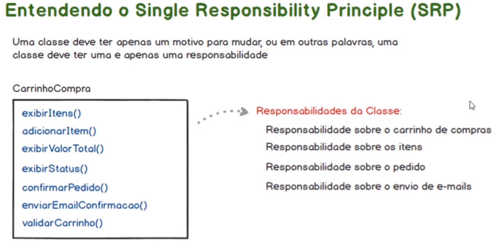
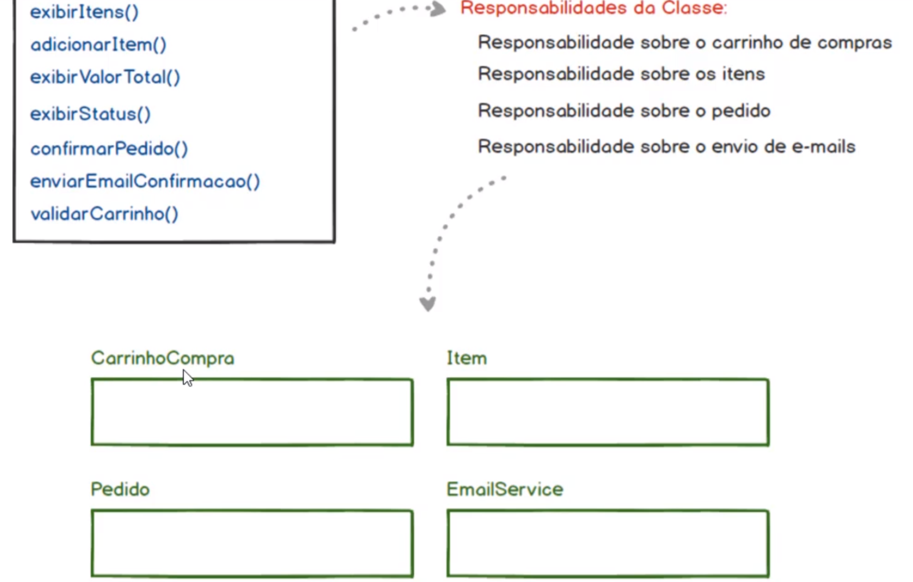
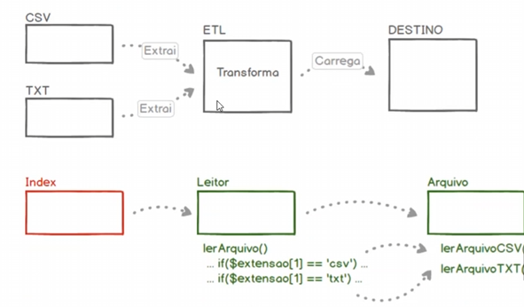
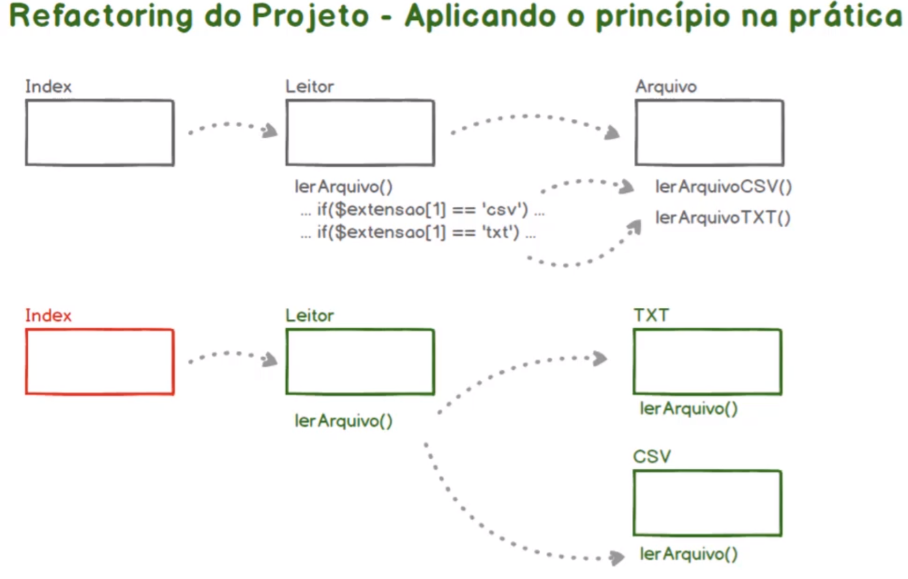
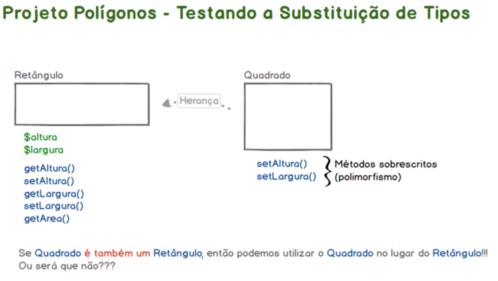
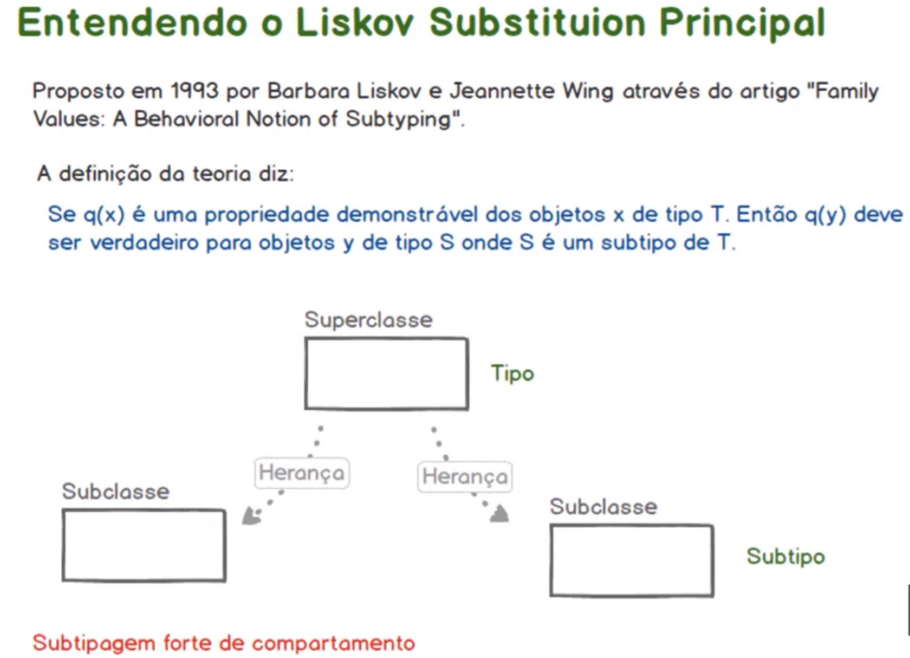
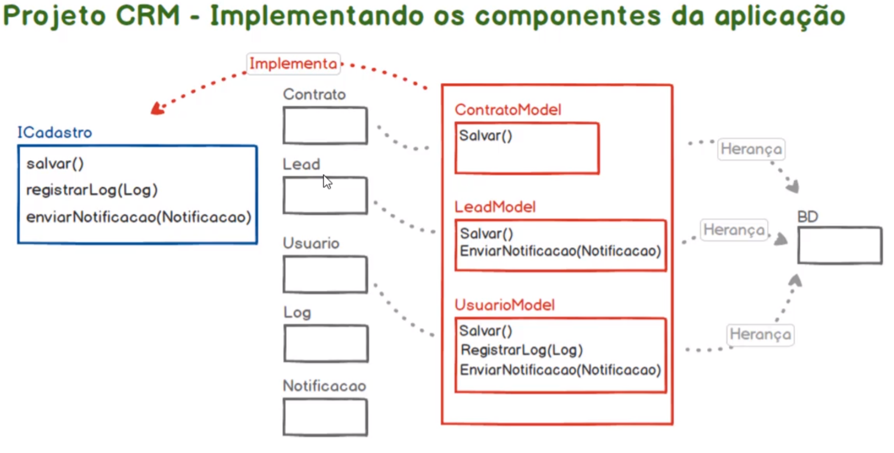
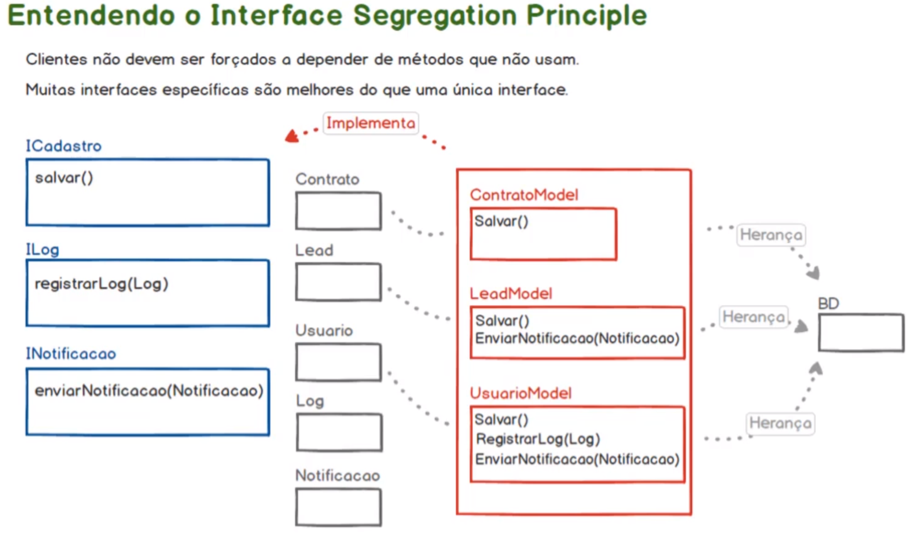

# Princípios do SOLID

## SRP - Single Responsibility Principle (Princípio da Responsabilidade Única)

### Uma classe deve ter apenas um motivo para mudar, ou em outras palavras, uam classe deve ter uma e apenas uma responsabilidade.

#### Prática - Cenário Inicial (app_carrinho_compras)

> Inicialmente foi apenas estruturado o projeto e codificado o projeto. 
> Nesse momento o projeto foi criado a classe CarrinhoCompra sem os princípios da SRP. 
> A classe possui 4 responsabilidades diferentes. 
>> Carrinho de compras é o que é esperado para a classe 
>> Os itens estão sendo estruturados internamente pela propria classe CarrinhoCompra. 
>> A classe também controla a confirmação do pedido. 
>> E também a classe assume a responsabilidade pelo envio de e-mails. 
>>> Se a classe assume essa responsabilidade, perde-se a oportunidade de reuso em outros ponto da aplicação. Afinal não faz sentido precisar instanciar a classe CarrinhoCompra apenas para aproveitar o método enviarEmailConfirmacao(). 
> O carregamento de diversas responsabiliades pela classe CarrinhoCompra dificulta as manutenções futuras e também dificulda a implementação de testes unitários ou automatizados. 

#### Prática - Cenário Ideal (app_carrinho_compras_b)

> Inicialmente, há o sentimento de que foram criadas várias classes desnecessárias, e que as funcionalidades poderiam estar todas presentes em uma única classe como feito anteriormente. 
> Foi feita a refatoração do projeto Carrinho de Compras, levando em consideração os princípios da responsabilidade única, onde as classes devem ter uma, e apenas uma, responsibilidade. 
> Nesse processo foram criadas várias classes para resolver o mesmo problema. 
>> Para que cada classe tenha uma responsabilidade única para atender a uma necessidade de negócio dentro do sistema. 

## OCP - Open/Closed Principle (Princípio Aberto Fechado)

### O que é uma alteração de código

> Ocorro quando precisamos acessar uma classe já existente para incluir ou modificar comportamentos, ou para incluir ou modificar métodos da classe.

### O que é uma expansão de código

> Requer uma conduta de abstração mais sofisticada no momento em que a classe está sendo implementada. Ou seja, é necessário pensar em como as classes poderão ser extendidads, de modo que, quando um novo comportamento seja necessário, que a classe já existente seja extendida ao invés de modificada.

### Observação

> O OCP é tido como o princípio mais polêmioco e pouco praticado do SOLID, por ser complexo de ser entendido, e consequentemente de ser utilizado no dia-a-dia.

#### Prática - Cenário Inicial (app_etl)

> Analisando a conduta de como foi implementado o projeto ETL. A aplicação recupera informação diversas fontes e transforma essas informações com o propósito de retorná-las em alguma saída. 
> Foram criadas classes chamadas Leitor e Arquivo, com responsabilidades únicas para atender aos princípios do SRP. 
> No início do projeto sabíamos que a aplicação seria responsável por ler informações de diversas origiem. 
> Quando foi implementado o primeiro o primeiro fluxo de leitura de arquivo CSV, foi criado a classe Leitor, com o método lerArquivo() e a classe Arquivo com o método lerArquivoCSV(). 
> Na sequencia, surgiu a necessidade de extender a aplicação, com a leitura de arquivos TXT e então foi criado o método lerArquivoTXT() na classe Arquivo. 
> Foi necessário acessar a classe Leitor para modificá-la e também necessário alterar a classe Arquivo para implementar um novo método. 
> Porém ao invés de ser implementado uma técnica de expansão, foram realizadas alterações no código, o que fere o princípio de Fechado para Alteração/Aberto para Expansão. 
> Embora as alterações atendam as necessidades, caso a aplicação cresça, por exemplo com a leitrua de arquivos SOAP ou XLSX. 
>> A ideia do princípio, em situações como o crescimento da aplicação, é pensar em como podemos implementar técnicas de expansão, sem que as classes pré-existentes sejam alteradas ou sofram modificações. 

#### Prática - Cenário Ideal (app_etl_b)

> Sempre quando um código for agregado a uma aplicação, que essa agregação seja feita através de uma extensão e não de uma alteração em código já existente. 
> Na prática é necessário alterar os códigos para que eles se tornem cada vez mais extensíveis.
> O conceito desse princípio é que, sempre que formos abstrair classes, que elas possuam características de extensibilidade, ao invés de precisar voltar em códigos pré-existentes para serem ajustados. 
> Para isso foi feito a refatoração do projeto ETL. Anteriormente o projeto possuia as classes Leitor e Arquivo, embora tendo responsabildiades únicas, sempre que um método de leitura precisasse ser implementado, seria necessário modificar ambas as classes, o que fere o princípio Open Closed. 
> Foi substituíodo a classe Arquivo por classes específicas, de TXT e CSV e ajustado a classe Leitor para adotar a metodologia de extensão de potenciais novos recursos. 
> Anteriormente seria necessario alterar o método lerArquivo() da classe Leitor, incluindo mais um else if para que fosse possível ler arquivos XLSX, e na classe Arquivo seria implementado o método lerArquivoXLSX(). Novamente, isso teria o princípio Open Closed.. 
> Ao criar a classe Leitor com a capacidade de extensão de novos recursos, poderia ser criado uma classe Xlsx que faria a leitura desse tirpo de arquivo.. 
> Foi validado como o Open Closed Principle pode auxiliar no dia-a-dia, as vantagens de criar classes capazes de exapandir ao invés de classes que devem ser constantemente manipuladas para incluir novas funcionalidades. 

## LSP - Liskov Substitution Principle (Princípio da Substitução de Liskov)

### A definição da teoria diz que: Se q(x) é uma propriedade demonstrável dos objetos x de tipo T. Então, q(y) deve ser verdadeiro para objetos y de tipo S onde S é um subtipo de T.

#### Prática - Cenário Inicial (app_poligonos)

> Foi definido um projeto para cálculo de polígonos. 
> Para essa abstração foi criado as classes Retangulo e Quadrado. 
> Porém, de acordo com o LSP, uma classe filha deve poder ser usada no lugar da classe pai sem que haja qualquer erro. 
> Se um Quadrado é um Retângulo, então dentro da aplicação deveríamos poder criar instâncias de Retângulo baseado na classe Quadrado. 
> Foi aplicado o conceito de Polimorfismo, onde uma classe filha modifica o comportamente herdado da classe pai, nesse caso, a classe Quadrado fazendo a sobrescrita dos metodos setAltura() e setLargura(). Nesse momento, foi ferida a tipagem forte de comportamento. 
> Embora pelo ponto de vista de negócio e matemático a implementação realizada fazer sentido, não está correto do ponto de vista programático. 

#### Prática - Cenário Ideal (app_poligonos_b)

> Agora o conceito de abstração precisa se tornar mais refinado, nesse cenário, não será mais abstraído objetos do mundo real diretamente para a aplicação. 
> Será necessário entender como os objetos se comportam internamente dentro da aplicação. O LSP propõe que deve-se tomar cuidado em relação a tipagem forte de comportamentos dos objetos. 
> A definição acima prova que objetos de tipos derivados (ou subtipos) devem ser capazes de substituirem os tipos primários. Ou seja, as classes filhas (ou subclasses) devem ser capazes de substituir, em qualquer contexto da aplicação, as suas respectivas classes pai (ou superclasse). 
> O Princípio de Substituição de Liskov está direcionado a sub tipagem forte de comportamento, ou seja, como podemos preservar os comportamentos da superclasse em suas subclasses, de modo que as subclasses em substituição da sua respectiva superclasse, produza o mesmo resultado no código. 
> O Princípio de Substituição de Liskov nos permite, de forma consistente, a abstrair objetos do mundo real, diferenciando as relações de herança de especialização de tipos que realmente fazem sentido em um contexto programático. 
> Para isso, foi retirado a relação de herança entre as clases Quadrado e Retangulo. 
> Também levando em consideração o princípio do SRP, foi criado a classe Poligono, para onde foi levado o método getArea(). 
> Seguindo também o princípio do OCP, agora pode ser criado diveras outras formas para o cálculo de suas respectivas áreas, sem que haja necessidade de modificar classes já existentes. O LSP acaba sendo uma extensão da OCP.

## ISP - Interface Segregation Principle (Princípio da Segragação de Interfaces)

### Clientes não devem ser forçado a depender de métodos que não usam. 

> Difente das classes, as interfaces não implementam os métodos, elas apenas definem a assinatura dos métodos. Elas funcionam como um contrato, quando uma classe implementa a interface ela obrigatoriamente implementa os métoodos definidos dentro dessa interface.  
> Portanto a relação de uma classe com uma interface se difere de uma herança, que por sua vez serve como extansão de uma classe, onde é feita a especialização dos comportamentos dessa classe. 

### Muitas interfaces específicas são melhores do que uma única interface.

> Isso gera baixo acoplamento e alta coesão. Para afim de que as classes clientes não sejam forçadas a implementar métodos que não serão utilizados 
> Segundo o ISP, se os métodos implementados não forem utilizados pelos objetos que serão instanciados a partir da classe, então não faz sentido a implementação desses métodos. 

#### Prática - Cenário Inicial (app_crm)

> Inicialmente foi estruturado o projeto apenas com os componentes básicos, dentro de um contexto onde faz sentido a utilização de uma interface. 
> Foram definidas 5 classes de componentes, 3 classes de DAO que extendem a classe BD, que fará um "mock" da conexão com o banco de dados. 
> Foi implementado a interface ICadastro com a assinatura dos métodos salvar(), registarLog(Log) e enviarNotificacao(Notificacao). 
> As classes de Model (Contrato, Lead e Usuario) implementam a interface ICadastro. A aplicação passa a lançar um erro caso os métodos da interface não sejam implementados na Model. 
> No cenário proposto acima, a classe ContratoModel precisa apenas do método salvar(), porém ao implementar a interface, a classe foi obrigada a implementar os outros métodos, que são desnecessários para a classe ContratoModel. 
> O mesmo ocorre com a classe LeadModel, que por sua vez só precisa dos métodos salvar() e enviarNotificacao(Notificacao), porém foi obrigado a implementar o método registarLog(Log). 
> A implementação praticada nesse cenário fere o Princípio da Segregação de Interface.

> #### Prática - Cenário Ideal (app_crm_b)

> Nesse momento, foi segradado as interfaces ICadastro, ILog e INotificacao, para atender ao Interface Segregation Principle. 
> Agora com interfaces segregadas, as lasses cliente só irão impelemtar interfaces cujos métodos serão utilizados pela classe. 
> Feito isso, não haverá mais a necessidade de implementar métodos dentro das classes por obrigação da interface que não serão usada pelos seus respectivos objetos. 
> A classe ContratoModel continua implementando a interface ICadastro. 
> Já na classe LeadModel será implementado as interfaces ICadastro e INotificacao. 

## DIP - Dependency Inversion Principle